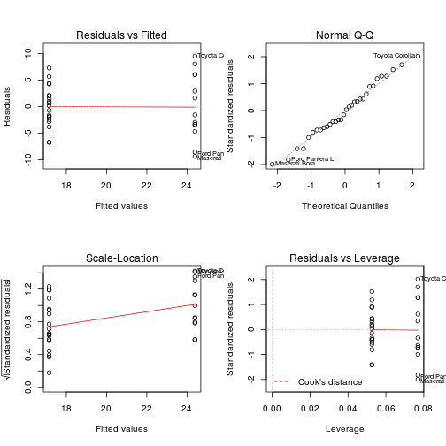

## MPG Regression Models

###    Introduction

    Simple App for the Developemnt Data Products Course Project.

    The Goal is to explore the relationship between miles per gallon (MPG)
    and a set of variables in the `mtcars` data set provide in R.

--- .class #id 

## MPG Regression Models

###   DataSet

    `mtcars` dataset is use to build our model predicton. 
    We load the mtcars data and take a look at the variables.
    And convert some variables into factors.
    

```r
mtcars$cyl = factor(mtcars$cyl)
mtcars$vs = factor(mtcars$vs)
mtcars$am = factor(mtcars$am)
mtcars$gear = factor(mtcars$gear)
mtcars$carb = factor(mtcars$carb)
levels(mtcars$am) = c("AT", "MT")
str(mtcars)
```

```
## 'data.frame':	32 obs. of  11 variables:
##  $ mpg : num  21 21 22.8 21.4 18.7 18.1 14.3 24.4 22.8 19.2 ...
##  $ cyl : Factor w/ 3 levels "4","6","8": 2 2 1 2 3 2 3 1 1 2 ...
##  $ disp: num  160 160 108 258 360 ...
##  $ hp  : num  110 110 93 110 175 105 245 62 95 123 ...
##  $ drat: num  3.9 3.9 3.85 3.08 3.15 2.76 3.21 3.69 3.92 3.92 ...
##  $ wt  : num  2.62 2.88 2.32 3.21 3.44 ...
##  $ qsec: num  16.5 17 18.6 19.4 17 ...
##  $ vs  : Factor w/ 2 levels "0","1": 1 1 2 2 1 2 1 2 2 2 ...
##  $ am  : Factor w/ 2 levels "AT","MT": 2 2 2 1 1 1 1 1 1 1 ...
##  $ gear: Factor w/ 3 levels "3","4","5": 2 2 2 1 1 1 1 2 2 2 ...
##  $ carb: Factor w/ 6 levels "1","2","3","4",..: 4 4 1 1 2 1 4 2 2 4 ...
```

--- .class #id 


## Model Selection

The user can select different set of variables to create the regreesion model.


```
## Error: could not find function "selectInput"
```

The model will be of the form.


```r
model1 <- lm(mpg ~ am, mtcars)
```


--- .class #id 


## Output

The main panel will show the residual plot and the summary of the compute model.


```r
par(mfrow = c(2, 2))
plot(model1)
```

 


