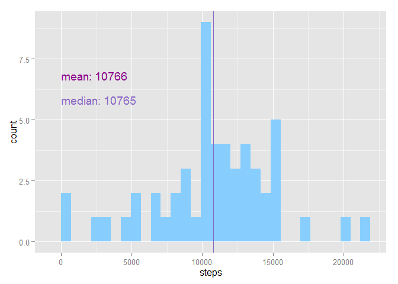
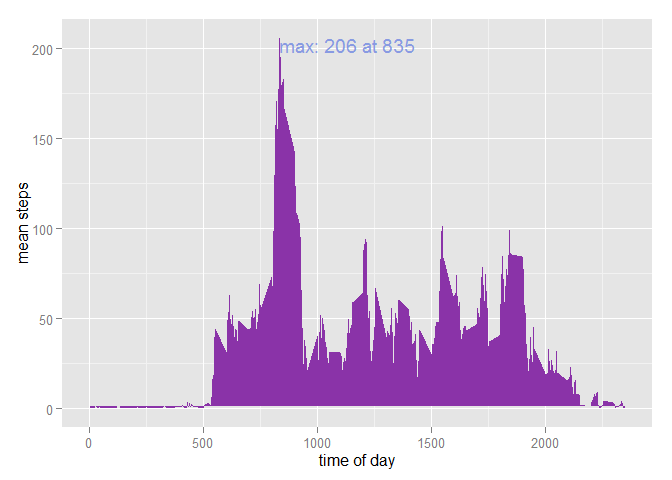
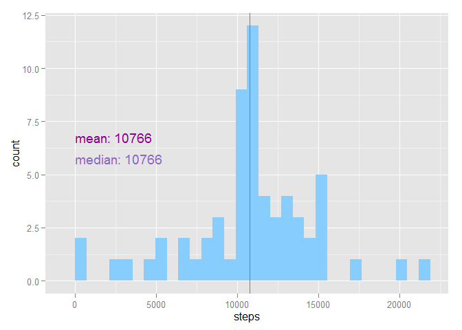
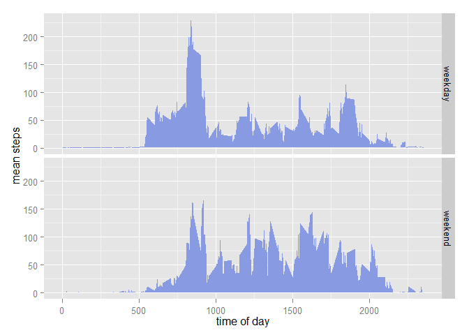

# Reproducible Research: Peer Assessment 1


```
## Warning: package 'knitr' was built under R version 3.1.1
## Warning: package 'ggplot2' was built under R version 3.1.1
```

## Loading and preprocessing the data


```r
FILE = "activity.zip"
CSV_FILE = unzip(FILE, list=TRUE)$Name[1]
if (!file.exists(CSV_FILE)) unzip(ZIP_FILE, files=CSV_FILE)

ori_data <- read.csv(CSV_FILE, colClasses=c("numeric","Date","numeric"))
ori_data$date <- as.Date(ori_data$date)
data <- ori_data[!is.na(ori_data$steps),]
summary(data)
```

```
##      steps            date               interval   
##  Min.   :  0.0   Min.   :2012-10-02   Min.   :   0  
##  1st Qu.:  0.0   1st Qu.:2012-10-16   1st Qu.: 589  
##  Median :  0.0   Median :2012-10-29   Median :1178  
##  Mean   : 37.4   Mean   :2012-10-30   Mean   :1178  
##  3rd Qu.: 12.0   3rd Qu.:2012-11-16   3rd Qu.:1766  
##  Max.   :806.0   Max.   :2012-11-29   Max.   :2355
```


## What is mean total number of steps taken per day?

Per day steps

```r
pday <- aggregate(list("steps" = data$steps), by=list("date" = data$date), FUN=sum)
Mean <- mean(pday$steps)
Median <- median(pday$steps)

with(pday, {
    ggplot(pday, aes(x=steps)) +   
      geom_histogram(fill=plotColors[1]) + 
      geom_vline(xintercept=Mean, col=plotColors[5]) +
      annotate("text", label = paste("mean:", round(Mean)),
    x = 0, y = 7, hjust = 0, vjust = 1, col=plotColors[5]) +
      geom_vline(xintercept=Median, col=plotColors[3]) +
      annotate("text", label = paste("median:", Median),
      x = 0, y = 6, hjust = 0, vjust = 1, col=plotColors[3])
})
```

```
## stat_bin: binwidth defaulted to range/30. Use 'binwidth = x' to adjust this.
```

 

The mean steps taken per day is 1.0766 &times; 10<sup>4</sup> with median 1.0765 &times; 10<sup>4</sup>.

## What is the average daily activity pattern?


```r
pinterval <- aggregate(list("steps" = data$steps), by=list("interval" = data$interval), FUN=mean)
max <- pinterval[pinterval$steps==max(pinterval$steps),]

with(pinterval, {
    ggplot(data = pinterval, aes(x=interval, y=steps)) +         
        geom_polygon(fill=plotColors[4]) +
        xlab("time of day") + ylab("mean steps") +
        annotate("text", label = paste("max:", round(max$steps), 'at', max$interval),
        x =max$interval, y = max$steps, hjust = 0, vjust = 1, col=plotColors[2])
})
```

 

maximum number of steps (206) at 835.

## Imputing missing values

Total # of missing values in the orginal dataset 2304.


Strategy: Substitute missing values with the average value for that time interval across all days.


```r
withDaily <- merge(ori_data, pinterval, by="interval", sort=FALSE, 
suffixes=c(".all",".dailymean"), all.x=TRUE)

mval_data <- withDaily[with(withDaily, order(date, interval)),
c("date","interval","steps.all","steps.dailymean")]

mval_data$steps <- ifelse(is.na(mval_data$steps.all), mval_data$steps.dailymean, mval_data$steps.all)

mval_pday <- aggregate(list("steps" = mval_data$steps), by=list("date" = mval_data$date), FUN=sum)
mval_Mean <- mean(mval_pday$steps)
mval_Median <- median(mval_pday$steps)

with(mval_pday, {
    ggplot(mval_pday, aes(x=steps)) +   
      geom_histogram(fill=plotColors[1]) + 
      geom_vline(xintercept=mval_Mean, col=plotColors[5]) +
      annotate("text", label = paste("mean:", round(mval_Mean)),
               x = 0, y = 7, hjust = 0, vjust = 1, col=plotColors[5]) +
      geom_vline(xintercept=mval_Median, col=plotColors[3]) +
      annotate("text", label = paste("median:", round(mval_Median)),
               x = 0, y = 6, hjust = 0, vjust = 1, col=plotColors[3])
})
```

```
## stat_bin: binwidth defaulted to range/30. Use 'binwidth = x' to adjust this.
```

 

The new dataset mean steps taken per day is 1.0766 &times; 10<sup>4</sup> with median 1.0766 &times; 10<sup>4</sup>. The original dataset mean steps taken per day was 1.0766 &times; 10<sup>4</sup> with median 1.0765 &times; 10<sup>4</sup>.
There is no significant impact to the daily average


## Are there differences in activity patterns between weekdays and weekends?


```r
weekdayFactor <- function(d) {
    wd <- (as.POSIXlt(d))$wday
    ifelse(wd==0|wd==6, "weekend", "weekday")
}


mval_data$weekday <- weekdayFactor(mval_data$date)
mval_pinterval <- aggregate(list("steps" = mval_data$steps),
by=list("interval"=mval_data$interval,"weekday"=mval_data$weekday), FUN=mean)

with(mval_pinterval, {
    ggplot(mval_pinterval, aes(x=interval, y=steps)) +
        facet_grid(weekday ~ .) +
        geom_polygon(fill=plotColors[2]) +
        xlab("time of day") + 
        ylab("mean steps")        
})
```

 

* The subject becomes active at a latter time during the weekends, also there is a spike in steps between 8~9 in the weekdays not present in the weekends. However the weekends show slightly more activity during the afternoons (12~21).
